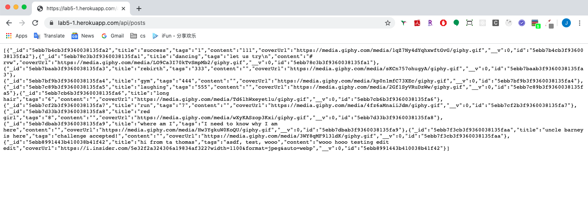

# starter express app template

I finished this lab and deployed to Heroku
* github url: https://github.com/dartmouth-cs52-20S/lab5-platform-api-luckyjialing
* lab5 heroku url: https://lab5-1.herokuapp.com/api
* lab4 update url: http://lab4_jialing.surge.sh/

## Open api
visit https://lab5-1.herokuapp.com/api/

## Get posts
visit https://lab5-1.herokuapp.com/api/posts

## Get posts by id
visit https://lab5-1.herokuapp.com/api/posts/5ebb7baab3f9360038135fa3

