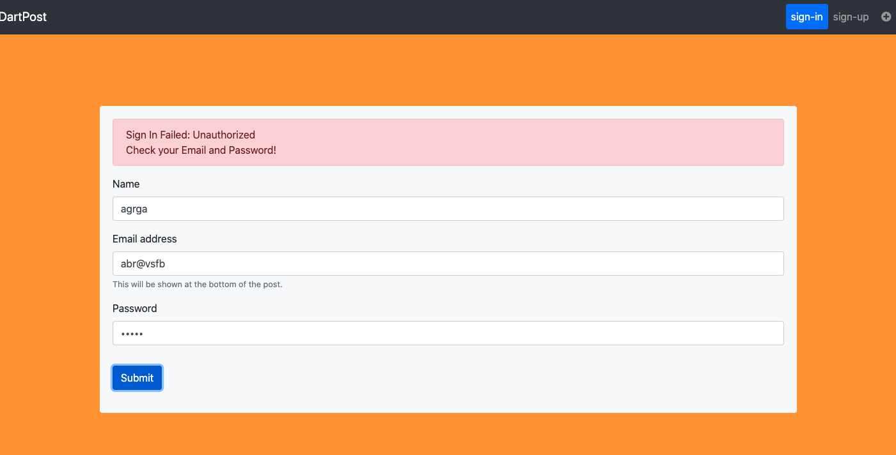

# starter express app template

I finished this lab and deployed to Heroku
* github url: https://github.com/dartmouth-cs52-20S/lab5-platform-api-luckyjialing
* lab5 heroku url: https://lab5-1.herokuapp.com/api
* lab4 update url: http://lab4_jialing.surge.sh/

## Open api
visit https://lab5-1.herokuapp.com/api/

## Get posts
visit https://lab5-1.herokuapp.com/api/posts

## Get posts by id
visit https://lab5-1.herokuapp.com/api/posts/5ebb7baab3f9360038135fa3

# Part 2 Auth

I finished all the requirements listed in the rubric. no extra credit tried:)

## sign up

At first, you need to sign up an account.

## sign in
after sign in with your sign up account.
Now you can create **new** post and edit your previous posts.

Please make sure you signed in with a right signed up account. If not, then you can not pass the **authentication**!!

## sign out
If you did not sign in or you have been signed out. Then you can not **add new** post or **edit** any existed post.
if you click the **add new** button, you will be directed to the **sign in** page. And if you click any existed post, you can not find the **edit** button.

## author information
If you wanna see the author information. click the post you want enter. and you can find the author information at the end of the post details.

## Home button
so every time you want to go back to the **Home Page**, click the **Dart Post** and here you go:)

Have fun with the play!
